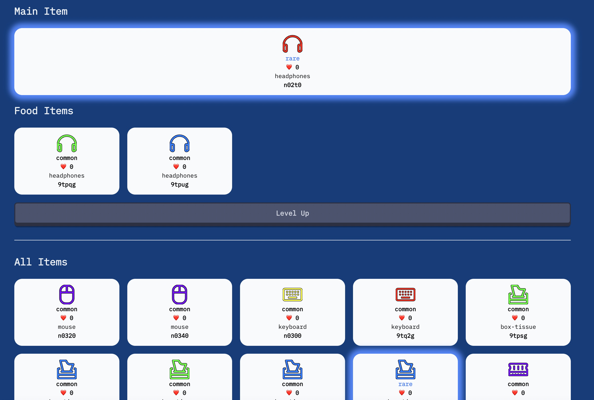

## About Me

Hi! My name is Hocky Yudhiono, people mostly call me Hocky with the calling nickname **Hock** 🌲.

- I really like emojis, I use them mostly when I write, because they express everything in a graphical way, but doesn't get in the way of the meaning 🏃‍♀️.

- I like to take notes, write blogs, and gather ideas 🧠.
- In my free time:
  - I play games, something like DotA 2, (used to play CS:GO, Genshin Impact, Audition Ayodance) 🎮.
  - I held daily concert when showering 🚿.
  - I really like to browse for unique and new stuffs, I watch and learn random things on the internet, from cooking, basketball, music and its instruments, breakdancing, make up and cosplay, riddles, stand up comedy videos, PC building, video editing, photoshop, android, operating systems and many more 🎁
  - I also spent most of my time watching Youtube. These days, I like to watch **SciShow**, Food vlogs, Movies or Series Recaps, **Vox**, and documentary videos. I also watch game highlights and VTubers 🐇. My favorite VTuber is Anya Melissa from Hololive Indonesia.
  - I also watch Netflix Movies, Series, and Animes 👀.
    - Game of Thrones, Dark, Wednesday Addams, The Umbrella Academy, 🧑‍⚖️
    - Star Wars Series ⭐️
    - Marvel Cinematic Universe ⚡️
    - Hunter x Hunter, Jujutsu Kaisen, KonoSuba, Re:Zero, Kimetsu No Yaiba, Bungou Stray Dogs, Boku No Hero Academia, Tokyo Revengers, Makoto Shinkai's Animes, and many more🧙‍♂️
    - Just mention any good movie you've watched. I'd say about 60-70% i've seen it 🎥.

## Fun Facts

- Used to have quite a long hair, but was cut in early 2022 (chest long), I like plushies as well, I name all of them .🐅. The left one is **Gido**, The small one is **Fugi**, they share the common surname, **Binostrovalte**. Doesn't have any specific meaning btw, just gibberish 😂.

- I was born on August 24th, 2002, anyone sharing the same birthday as me 🐎?
- I am not a picky eater, I eat basically anything from spicy, vegetable, sweets, bitter, chewy. You can see me as an omnivorous bear 🐻.
- I can speak English, Bahasa, Teochew, Hakka (Both of these last two are southern chinese languages) and currently learning Japanese and Mandarin Chinese 🌝. I know a bit of Thai, Hindi, Tagalog from my friends, but they only taught me basic sentences and the curse words 😊.
- I can raise both of my eyebrows 😭.

- Too many weird stuffs that I do and know, prolly you can know me more as we talk! 😱

## Family

I have 2 older sisters, my eldest sister is a medical doctor, currently taking her Pediatric Specialist (Dokter Anak) education. The second one studied Pharmacy 💊. My father is retired, he spents his day doing karaoke and gardening. My mother likes to read and currently studying languages as well 😱. We love to travel, when we all have free time, visiting neigboring countries and/or places in Indonesia is a common thing to do. 

## Programming Life

I do competitive programming, I like to solve algorithmic problems, and love to code myself a new project, doing something in a sitting is my favorite. My favorite techs 💻 are:

- Web Backend:
  - Gin Gonic, Echo in GoLang 🌲
  - FastAPI and Django in Python,💧
  - Next.js in Typescript or JS! 🔥
- Web Frontend
  - Next.js 🌈
  - Vanilla HTML! (really love doing these manual css HAHHAHAHA 🤦‍♀️)
- Programming Languages (Ordered descending from the best):
  - C++ (This just plain fun) 😭
  - Python, TS, Js (Interpreted languages are fine)
  - Golang (Blazingly fast, but poor library support 👀)
  - (I don't really like Java because it feels slow HAHAHAHA)

- Operating Systems (Ordered by my most to least favorite):

  - Ubuntu (A good OS to code, very light and easily customizable!) 🚩
  - Windows (No native linux support, WSL is nasty i hate it, Superior for productivity and having fun) 😱 
  - Mac OS (Python modules on M1 has tons and tons of issues, Virtual Memory setting for C++ is very uncustomizable, I still hate the keyboard layout, apps are expensive, battery is amazing, support is amazing, the most seamless in terms of performance compared to other OS) 🐍

- Favorite personal projects:

  - **PeerToCP**, with Electron.js, WebRTC. A real time collaboration coding desktop IDE which allows you to share IDE and handle disconnection/offline issue.
    - 
  - [**Ajaib Crypto**](https://ristek.link/ajaib). a cryptocurrency platform, made with React Native (mobile apps) and Express for the backend server. This is a 7 man projects, but it's quite fun to do it. 
    - 

  - [Miteiru](https://github.com/hockyy/miteiru), a video player which enhance the experience for Japanese subtitles. It adds a dictionary, sentence analysis and parser. Built with Electron.js.
    - 
    - 
  - [Dungeons and Dracode](https://dnd.hocky.id/), a grinding game which in game currency can be earned by solving programming problems.
    - 
    - 